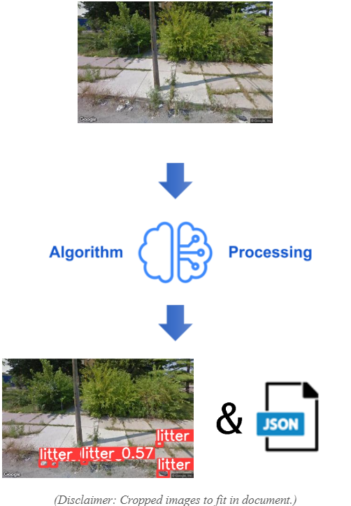
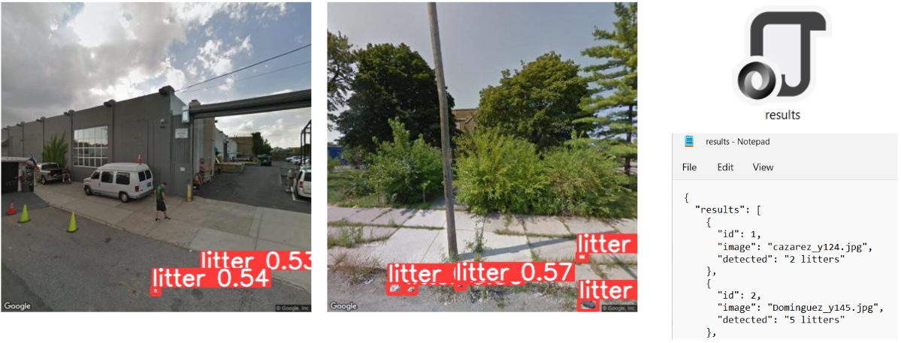

  <table align = "center" ><tr align = "center" height = "200" ><td align = "center" width="1200">
    
  </td></tr></table>

# ML Project: Keep America Beautiful Litter Processor 

  - Class: CIS 490 - Project Management & Practice
  - Professor: Dr. Shaun-inn Wuu 
  - Client: Jared Macshane
  - Spring 2022

<!-- Live demo [_here_](https://www.example.com).--> <!-- If you have the project hosted somewhere, include the link here. -->

## Table of Contents
* [General Info](#general-information)
* [Requirements](#requirements)
* [Timeline](#timeline)
* [System View](#system-view)
* [Main Dependencies](#main-dependencies)
* [Implementation](#implementation)
* [List of Deliverables](#list-of-deliverables)
* [Team](#team)

## General Information
Keep America Beautiful is a leading national nonprofit organization that inspires and educates people to take action every day to improve and beautify their community environment. They envision a country in which every community is a clean, green, and beautiful place to live.

The Sushi Team is grateful for the opportunity to work with Keep America Beautiful in developing a Machine Learning algorithm that will detect instances of litter in Google Street images. While the aimed general usage of the algorithm is for Keep America Beautiful's Web App team, the algorithm can be used without them. 

## Requirements

  

## Timeline

## System View

  

## Main Dependencies
- [Google Cloud Platform](https://cloud.google.com/).
  - [Our documentation for Google Cloud](https://github.com/SushiTeam2022/KAB-ML/blob/main/Documentation/Machine%20Requirements.pdf).
- [YOLOv5 Object Detection Model](https://github.com/ultralytics/yolov5).
  - [Our documentation for YOLOv5](https://github.com/SushiTeam2022/KAB-ML/blob/main/Documentation/YOLOv5%20Documentation.pdf).
  - [YOLOv5 - Latest version compatible with our code at this time](https://github.com/SushiTeam2022/KAB-ML/tree/main/YOLOv5).
- [RoboFlow](https://roboflow.com/).
  - [Our documentation for RoboFlow](https://github.com/SushiTeam2022/KAB-ML/blob/main/Documentation/RoboFlow%20Guide.pdf).

## Implementation
The boneworks of our system comes through the utilization of a Google Cloud server, the integration of the the YOLOv5 object detection model - with training and testing to detect litter in Google Street images, and the development of a Python script to formulate the process of our system - pertaining to inputs, outputs, and it’s ability to do frequent operations of processing Google Street images.

In order to train the YOLOv5 model to be able to detect litter in Google Street images, we also had to utilize Roboflow, a general purpose Machine Learning site, in order to create a Google Street image dataset.

### Dataset Example:

  
  

Once the YOLOv5 model had been trained with the Google Street image dataset, we then moved towards the development of our main Python scripts, to not only load the model to run inferences on, but to also establish a scheduling hook, in which the code will receive & process a set of Google Street images sent from a user. This hook is done through a TCP connection, with Socket Programming in the Python language.
- TCP Client and Server code can be found [here](https://github.com/SushiTeam2022/KAB-ML/tree/main/Scripts%20%26%20Weights). The Server code also acts as our Detection code, which is demonstrated in our [TCP-Detection Manual](https://github.com/SushiTeam2022/KAB-ML/blob/main/Documentation/TCP-Detection%20Manual.pdf).  

### Inference Example:

  
  

### Results Example:

  
  

 
Currently, we have created a system that can receive and process Google Street images from a user, in which a Machine Learning algorithm will be able to detect instances of litter in the received Google Street images. Once the litter instances have been identified, the system will then output the results into an image with bounding-boxes, identifying the litter, and a JSON file, textualizing the results, for the user.

## List of Deliverables
Machine Learning code/algorithm that will be compatible and usable with the Web App team.
- Algorithm components:
  - Input of multiples Google Street images.
  -	Litter detection (YOLOv5).
  -	Bounding box & JSON output (total amount of litter)
    - Show accuracy/confidence level in litter prediction 
  - A scheduling hook by which a user, such as the Web App team, can use this algorithm.
    - Through a TCP connection/Socket programming
  - [GitHub repository](https://github.com/SushiTeam2022/KAB-ML).
    - Python script, Instructional user manual and documentation for development, and a fully functional, modified YOLOv5 model.

### Conditional Feature:
One of the deliverables we tried to aim for was:
- The categorization of detected litter (e.g. Plastic, Paper, Organics,...).
However, due to time constraints and interference by a third party, who were supposed to assist us in the development of this feature, we were unable to achieve this deliverable.   
   
                                                             

## Team
Noah M. | Juan G. | Keith G. | Jordan F. | Miguel M.
