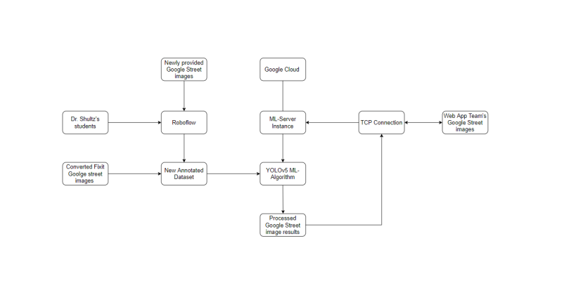

  <table align = "center" ><tr align = "center" height = "200" ><td align = "center" width="1200">
    
  </td></tr></table>

# ML Project: Keep America Beautiful Litter Processor 

  - Class: CIS 490 - Project Management & Practice
  - Professor: Dr. Shaun-inn Wuu 
  - Client: Jared Macshane
  - Spring 2022

<!-- Live demo [_here_](https://www.example.com).--> <!-- If you have the project hosted somewhere, include the link here. -->

## Table of Contents
* [General Info](#general-information)
* [Requirements](#requirements)
* [Timeline](#timeline)
* [System View](#system-view)
* [Dataset](#dataset)
* [Deliverables](#deliverables)
* [Development Process](#development-process)
* [Team](#team)

## General Information
Keep America Beautiful is a leading national nonprofit organization that inspires and educates people to take action every day to improve and beautify their community environment. They envision a country in which every community is a clean, green, and beautiful place to live.

The Sushi Team is grateful for the opportunity to work with Keep America Beautiful in developing a Machine Learning algorithm that will detect instances of litter in Google Street images. While the aimed general usage of the algorithm is for Keep America Beautiful's Web App team, the algorithm can be used without them. 

## Requirements

## Timeline

## System View
<table align = "center" ><tr align = "center" ><td align = "center" >

   

 </td></tr></table>

## Dataset

  
  
  

  
  
  
 
 
## Deliverables
-	Machine Learning code/algorithm that will be compatible and usable with the Web App team.
- Algorithm will produce data that will include:
  - Detection of litter in an image.
  -	Track total amount of litter.
  -	Show the detection accuracy in testing (e.g. 90% sure this is a Plastic bottle-Litter). -	Striving for/Conditional features: 
-	Categorize the litter (e.g. Plastic bottle, Paper bag).

## Development Process
Keep America Beautiful is a leading national nonprofit organization that inspires and educates people to take action every day to improve and beautify their community environment. They envision a country in which every community is a clean, green, and beautiful place to live.

The Sushi Team is grateful for the opportunity to work with Keep America Beautiful in developing a machine learning algorithm to detect litter through the colllection of google street images. Also, the Sushi Team partnered up with a web app team which are contributing in developing a web application that send us a google street images as input and the machine learning process it and their application collect them and use them.

The Sushi Team merge two dataset, one develop by fixIT and the other was collected by the web app team. The dataset were annotated, reviewed and submitted for training.  The Sushi Team uses the machines learning Algorithm YoloV5 to detect the amount of litter in the google street images. The YoloV5 uses a customized weights for pre-train and later train the new merged dataset.    
                                                             

## Team
Noah | Juan | Keith | Jordan F. | Miguel M.
