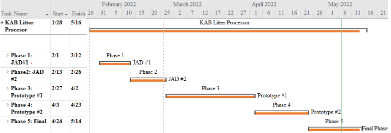

 

 

# Project: KAABML 
  - Class: Project Management
  - Professor: Dr. Shaun-inn Wuu 
  - Project: Liter Detection Project
  - Spring 2022

> Live demo [_here_](https://www.example.com). <!-- If you have the project hosted somewhere, include the link here. -->

## Table of Contents
* [General Info](#general-information)
* [Requirements](#requirements)
* [Timeline](#timeline)
* [System View](#system-view)
* [Dataset](#dataset)
* [Deliverables](#deliverables)
* [Development Process](#development-process)
* [Contact](#contact)

## General Information
- Create a machine learning algorithm that is able to receive Google Street images, and return the results. The results are
  an google streat image with the litter found marked in it. Also, it will show the confidence/accurray in the google street image. Additonally, a json   
  file that textualize the amount litter found in the pictures.
  
- The user will connect to the machine lerning algorithm with a TCP connection through Socket Programming develop in Python language.

## Requirements
- Open the Deep Learning VM Deployment Page in the GCP Marketplace( We selected the n1-highmem-4 which utilized 4 vCPUs and includes 26 GB memory) 
- Add a GPU, the NVIDIA Tesla T4 is the least expensive option and will work for our needs. 
- Verify “Install NVIDIA GPU driver automatically on first startup?” is selected. 
  (A minimum 150 GB persistent boot disk size should be selected,   however more would be better depending on the dataset being used and how much   
   information you plan on working on at once)

- git clone https://github.com/SushiTeam2022/KAAB-ML/tree/main/YOLOv5   # clone
- cd yolov5
- pip install -r requirements.txt 

## Timeline

<!-- -->
## System View

## Dataset

  
  
  

  
  
  
 
 
 
  
  
  

 
## Deliverables
-	Machine Learning code/algorithm that will be compatible and usable with the Web App team.
-	Algorithm will produce data that will include:
  -	Identification of litter in an image.
  -	The total amount of litter.
  -	Show the detection accuracy in testing (e.g. 90% sure this is a Plastic bottle-Litter).
  -	Striving for/Conditional features: 
-	Categorize the litter (e.g. Plastic bottle, Paper bag).

Proceed to describe how to install / setup one's local environment / get started with the project.

## Development Process
Keep America Beautiful is a leading national nonprofit organization that inspires and educates people to take action every day to improve and beautify their community environment. They envision a country in which every community is a clean, green, and beautiful place to live.

Room for improvement:
- Improvement to be done 1
- Improvement to be done 2

To do:
- Feature to be added 1
- Feature to be added 2

## Team
Noah | Juan | Keith | Jordan F. | Miguel M.
